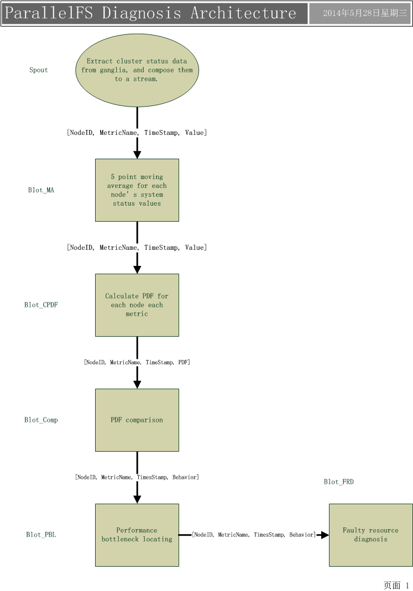

# ParallelFS Diagnosis Architecture Overview -- key parameter specification
## architecture

## preparation

1. generating cluster status stream.
2. standardize TimeStamp(discretize time and complement missing status data for some TimeStamp).
3. the method of calculating PDF, and distance of two PDF.
4. how to split PDF comparison tasks(__split by metric__)

## spout
there are two options to implement spout:

1. use python reading monitoring data from ganglia and send it to kestrel, use storm consume tuples from kestrel.
2. use java related rrd API to read data directly from ganglia.

## moving average
5 point moving average. 

1. receive tuple in form of [NodeID, MetricName, TimeStamp, Value].
2. maintain an "OriginalStreamQueue" for each node each metric in size of 5.
3. calculate 5 point moving average of the queue when one new related tuple (for the node and the metric) arrives.(before calculation, remove oldest tuple in the queue and add the new one).
4. send tuple in form of [NodeID, MetricName, TimeStamp, Value].

## calculate PDF
calculate the PDF[^PDFcontinuous], estimated by Histogram[^Histogram], for the smoothed stream in the window with size of "WinSize". and calculate PDF again after some other new tuples having arrived. and the new tuples' amount should reach "WinShift".

1. receive tuple in form of [NodeID, MetricName, TimeStamp, Value].
2. maintain a "SmoothedStreamQueue" for each node each metric in size of "WinSize", an a "NewTuplesCounter" for new tuples that arrived after last PDF calculation.
3. "NewTuplesCounter" add 1 to itself when a new tuple arrives, and remove oldest tuple from the queue "SmoothedStreamQueue", add the new one.
4. calculate PDF of the "SmoothedStreamQueue" when "NewTuplesCounter" equals to "WinShift", and set "NewTuplesCounter" as "0".
5. send tuple in form of [NodeID, MetricName, TimeStamp, PDF].

## PDF comparison
calculate the distances of each node with all other nodes. if half of the distances[^KLdivergence] exceed the threshold in one metric, then mark the node as anomalous.

1. receive tuple in form of [NodeID, MetricName, TimeStamp, PDF]
2. maintain a "Map" between "TimeStamp" and "DistanceList" for each node each metric, the "DistanceList" save the Distances from the node to others.
3. maintain a "PDFbuffer" for each node each metric. indexed by "TimeStamp".
4. when a new tuple arrives, calculate the PDF distance of the related node and metric to others. and compare the calculation result with the "threshold", then set the comparison result to the "DistanceList"s of the "TimeStamp" for all node involved if exists( a distance involves two nodes). add 1 to the "AnomalousCounter" of "NormalCounter" for each changed "DistanceList". check the "AnomalousCounter" and "NormalCounter" of all nodes of the "TimeStamp", if one of the two is larger than half of "DistanceList" size, then send the appropriate tuple, and delete the "DistanceList" of "TimeStamp" for the node.
5. now just specify an certain size for "PDFbuffer". just remove oldest PDF when new PDF tuple arrives[^PDFbufferAlternativeManage].
6. send tuple in form of [NodeID, MetricName, TimeStamp, Behavior].

## performance bottleneck locating
locating the faulty server. when a server have receive more than "k" tuple that reporting a server is anomalous in one metric in last "2k-1" tuples, the server is marked as anomalous.

1. receive tuple in form of [NodeID, MetricName, TimeStamp, Behavior].
2. maintain a "StatusQueue" for each node each metric in size of "2k-1".
3. update "StatusQueue" of the node the metric and calculate the amount of the tuples that are marked as anomalous in the "StatusQueue", when a new tuple of the node the metric arrives. if the amount is larger than "k", then send tuple that report fault.
4. send tuple in form of [NodeID, TimeStamp] to result display bolt.
5. send tuple in form of [NodeID, MetricName, TimeStamp, Behavior] to faulty resource diagnosis bolt.

## faulty resource diagnosis
analysis and determine which resource is responsible for performance degradation of the faulty server.

1. receive tuple in form of [NodeID, MetricName, TimeStamp, Behavior].
2. for each faulty node, analysis the faulty metric and behavior, to determine the scarce resource.
3. send tuple in form of [NodeID, TimeStamp, ScarceResourceType] to result display bolt.

## result display
display parallelFS diagnosis result.

1. receive tuple in form of [NodeID, TimeStamp].
2. receive tuple in form of [NodeID, TimeStamp, ScarceResourceType]
3. display and save parallelFS diagnosis result.

[^PDFbufferAlternativeManage]: An alternative PDFBuffer management scheme is that, maintaining an "TimeStampOldest" variable, when one "DistanceList" is deleted, search all nodes' __THE__ metric's Map between "TimeStamp" and "DistanceList", and find out the smallest "TimeStamp", update the "TimeStampOldest". Then delete all nodes' THE metric PDF in "PDFBuffer" index by "TimeStamp" smaller than "TimeStampOldest".

[^KLdivergence]: [Kullback–Leibler divergence](http://en.wikipedia.org/wiki/Kullback–Leibler_divergence)

[^PDFcontinuous]: [Probability density function](http://en.wikipedia.org/wiki/Probability_density_function)

[^Histogram]: [ Histogram ](http://en.wikipedia.org/wiki/Histogram)
